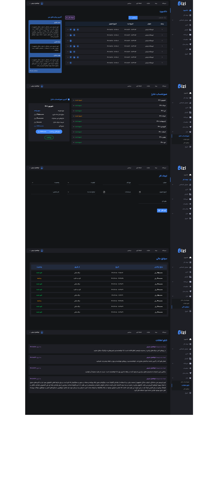

# Admin Dashboard(CMS) With Next JS

This project only contains Front-End code and does not include Back-end code

This project includes pages: [/index](https://github.com/vcabolfazl/Admin-Dashboard/blob/master/src/pages/index.jsx)  _  [/CreateWork](https://github.com/vcabolfazl/Admin-Dashboard/blob/master/src/pages/CreateWork.jsx)  _  [/Charge](https://github.com/vcabolfazl/Admin-Dashboard/blob/master/src/pages/Charge.jsx)  _  [/Bulletin](https://github.com/vcabolfazl/Admin-Dashboard/blob/master/src/pages/Bulletin.jsx)  _  [/Financial](https://github.com/vcabolfazl/Admin-Dashboard/blob/master/src/pages/Financial.jsx)
### Technologies used :
- Next JS
- React JS
- react-multi-date-picker
- Tailwindcss
- Css
- postcss

### [Contact me through Telegram](https://t.me/vc_abolfazl)

## A view of the site

